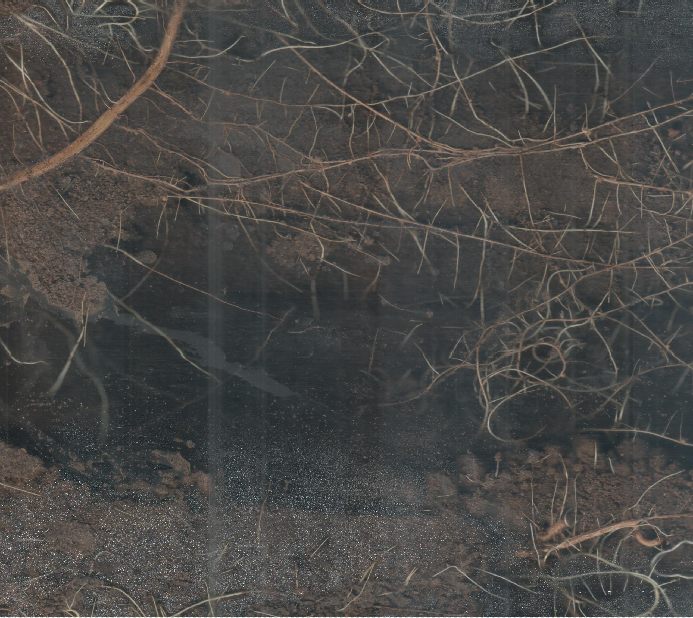
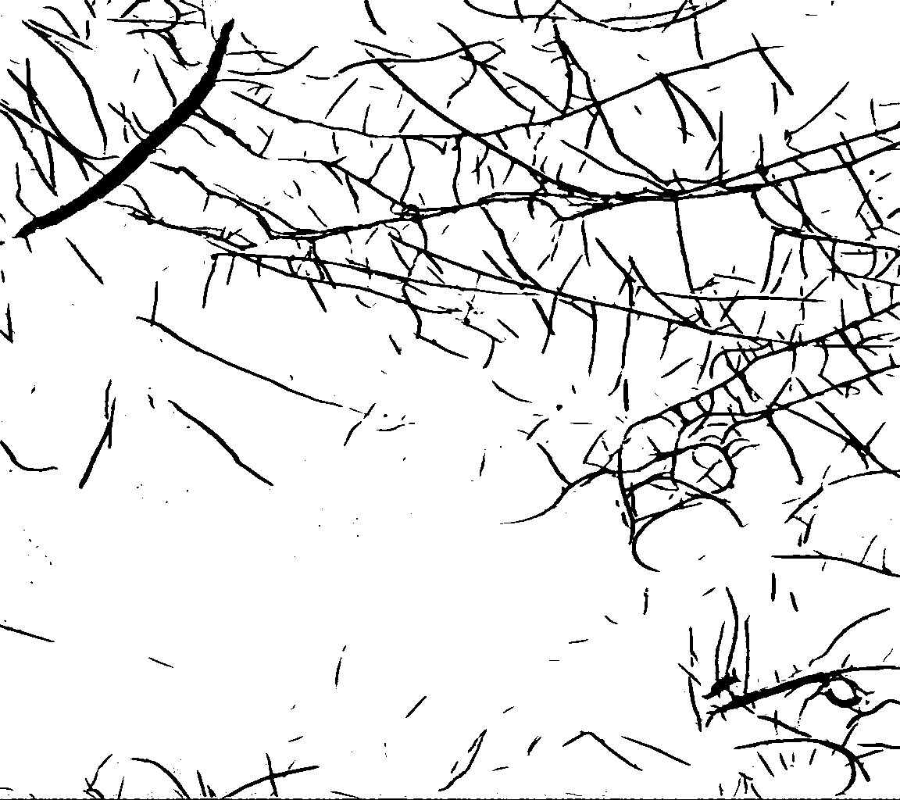
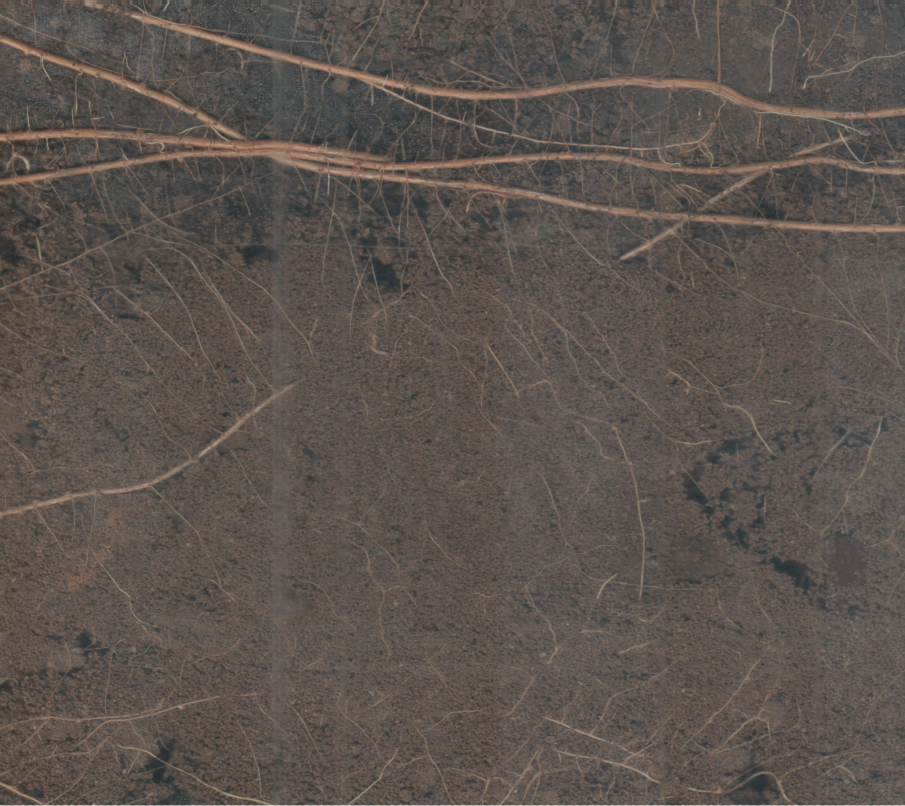
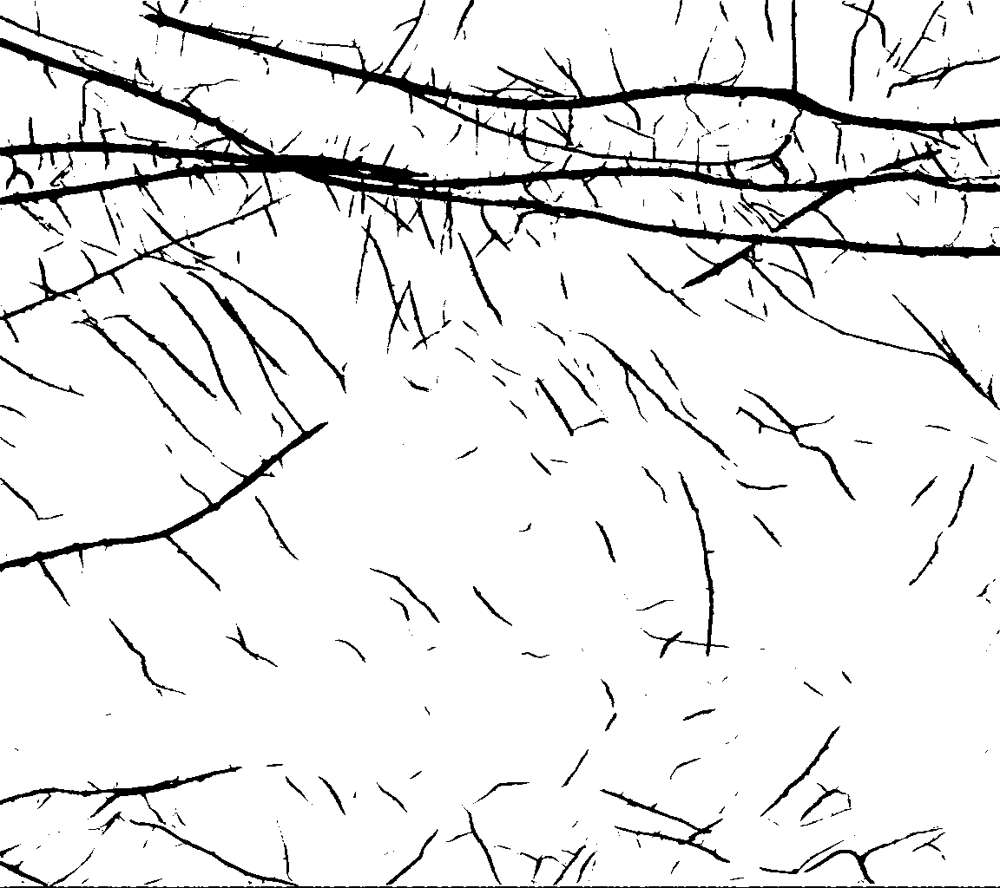
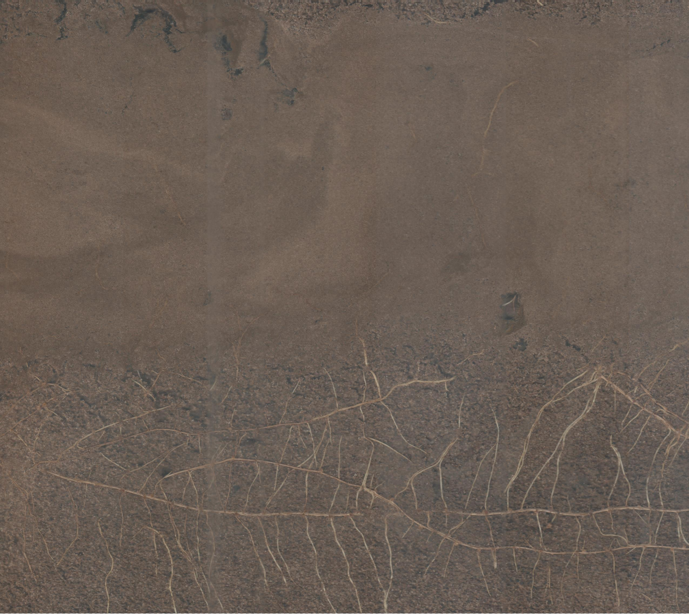
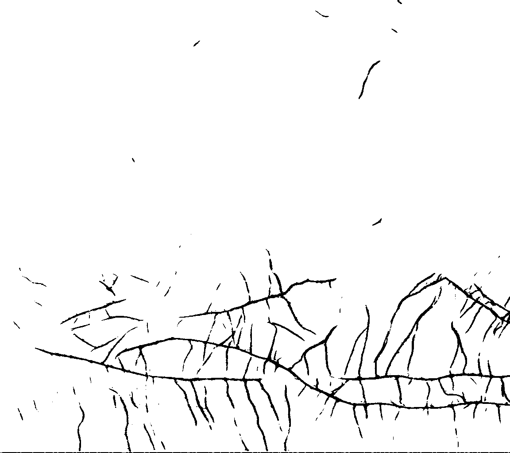

# 🌱 RhizoAnnotator

**Automated root segmentation from minirhizotron images using deep learning, enabling scalable and reproducible root analysis.**

🔗 Repository: https://github.com/egubens/RhizoAnnotator

---

## 🔬 Overview

**RhizoAnnotator** is a deep learning–based tool for segmenting roots from minirhizotron images.

⚠️ **This repository is intended for inference/segmentation only. It does NOT include training pipelines.**

It generates **binary masks** where:

- **Roots = black (0)**
- **Background = white (255)**

The tool is designed for:

- Rapid annotation of large image datasets  
- Downstream quantitative analysis (root length, density, distribution)  
- Reproducible workflows in soil and plant sciences  

---

## 🚀 Intended Use

This tool is **primarily designed to run in Google Colab with GPU acceleration** for ease of use and accessibility.

---

## 🚀 Quick Start (Google Colab)

### 1. Open the notebook in Google Colab
Upload or open:
`inference_colab.ipynb`

### 2. Enable GPU
Runtime → Change runtime type → T4 GPU

### 3. Run the notebook

The notebook will:
- Mount Google Drive automatically  
- Prompt you to set image paths  
- Download model weights  
- Run segmentation  
- Save masks  

👉 **Important:** Follow the instructions printed inside the notebook cells.

---

## 🖥️ Running in JupyterLab / Local Environment

RhizoAnnotator can also be run locally using JupyterLab or a Python script.

### Requirements
- Python ≥ 3.9  
- torch  
- torchvision  
- pillow  
- matplotlib  
- tqdm  
- gdown  

### Installation
```bash
pip install torch torchvision pillow matplotlib tqdm gdown
```

### Steps
1. Set local paths:
```python
IMG_DIR = "/path/to/your/images"
WEIGHTS_PATH = "rhizoannotator_v1.pt"
```

2. Run the notebook or script.

### Notes
- GPU is optional but **strongly recommended**  
- CPU execution is significantly slower  
- Google Drive mounting is **not required** outside Colab  

---

## 📥 Model Weights

Weights are automatically downloaded when running the notebook.

[rhizoannotator_v1.pt](https://github.com/egubens/RhizoAnnotator/releases/download/V1.0.0/rhizoannotator_v1.pt)

---

## 📂 Input Requirements

- Supported formats: `.png`, `.jpg`, `.jpeg`, `.tif`
- RGB images only
- Recommended resolution: ≥1000 px per side

---

## ⚙️ Key Parameters

```python
IMG_SIZE = (1024, 1024)
BATCH_SIZE = 4
THRESHOLD = 0.5
NUM_PREVIEW = 10
```

---

## 📤 Output

- Masks saved as: `originalname-mask.png`
- Format: PNG (lossless)
- Values:
  - 0 → root  
  - 255 → background  

---

## 📊 Example Results

<table align="center">
  <tr>
    <td align="center">
      <br>
      <sub>Image 1</sub>
    </td>
    <td align="center">
      <br>
      <sub>Mask 1</sub>
    </td>
  </tr>
  <tr>
    <td align="center">
      <br>
      <sub>Image 2</sub>
    </td>
    <td align="center">
      <br>
      <sub>Mask 2</sub>
    </td>
  </tr>
  <tr>
    <td align="center">
      <br>
      <sub>Image 3</sub>
    </td>
    <td align="center">
      <br>
      <sub>Mask 3</sub>
    </td>
  </tr>
</table>

---

## ⚠️ Important Notes

- Images are resized before inference  
- If GPU memory errors occur, set `BATCH_SIZE = 1`  
- CPU execution is slower  

---

## 🧪 Limitations

- Model performance depends on similarity to training data  
- No patch-based inference yet  

---

## 📖 Citation

If you use this tool, please cite:

```
Gutiérrez Benites, E. D. (2026).
RhizoAnnotator: Automated root segmentation from minirhizotron images using deep learning.
GitHub repository. https://github.com/egubens/RhizoAnnotator
```

---

## 📜 License

MIT License

---

## 🔮 Future Work

- Patch-based inference  
- Root trait extraction  
- Improved generalization  

---

## 🤝 Contributing

Open an issue for suggestions or bugs.
